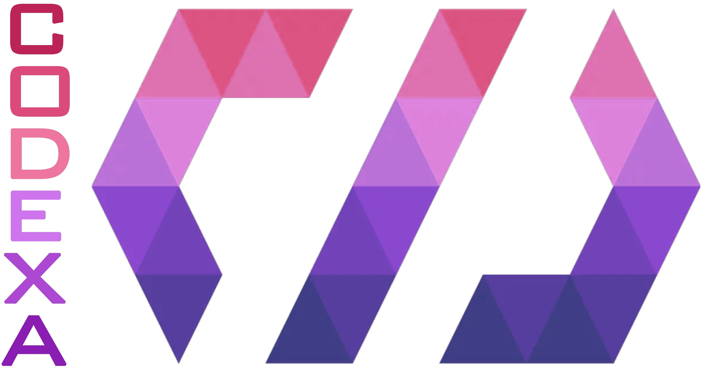
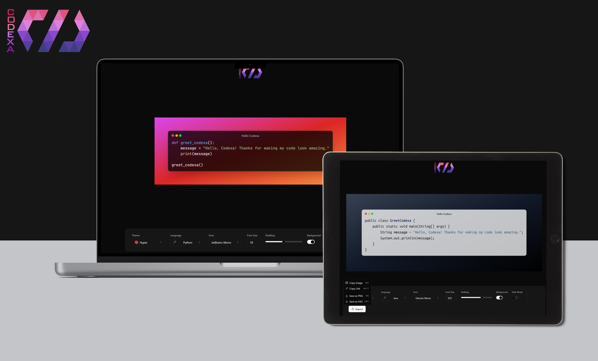

<div align="center">
  
</div>

# Codexa

Codexa is a versatile web application designed for developers and coders who want to create and share beautiful snapshots of their code snippets effortlessly. With Codexa, you can showcase your code in style, personalize it with various themes, fonts, and settings, and share it with the world. Whether you're a seasoned programmer or just starting your coding journey, Codexa is the perfect tool to enhance the visual appeal of your code snippets.

## Demo

Codexa is deployed to Vercel. You can try it on the following URL: [codexa.vercel.app](https://codexa.vercel.app/).

<div align="center">
  
</div>

## Technologies Used

- React.js
- Zustand
- Tailwind
- Shadcn UI

## Installation

To install and run Codexa locally, follow these steps:

1. Clone the project repository.
2. Navigate to the project directory.
3. Install the necessary dependencies by running the following command:

```
npm install
```

4. Run the project by executing the following command:

```
npm run dev
```

5. Access the application by visintg http://127.0.0.1:5173
